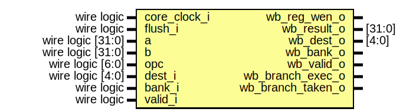

# Entity: alu 
- **File**: alu.sv

## Diagram

## Ports

| Port name         | Direction | Type              | Description                                     |
| ----------------- | --------- | ----------------- | ----------------------------------------------- |
| core_clock_i      | input     | wire logic        | Clock signal                                    |
| flush_i           | input     | wire logic        | Flush signal                                    |
| a                 | input     | wire logic [31:0] | First operand from register bank a              |
| b                 | input     | wire logic [31:0] | Second operand from register bank b / Immediate |
| opc               | input     | wire logic [6:0]  | Opcode from instruction                         |
| dest_i            | input     | wire logic [4:0]  | Destination register within bank                |
| bank_i            | input     | wire logic        | Bank number                                     |
| valid_i           | input     | wire logic        | current cycle is valid                          |
| wb_reg_wen_o      | output    |                   | Write register next cycle                       |
| wb_result_o       | output    | [31:0]            | Result to write                                 |
| wb_dest_o         | output    | [4:0]             | Destination register within bank                |
| wb_bank_o         | output    |                   | Bank number                                     |
| wb_valid_o        | output    |                   | next cycle is valid                             |
| wb_branch_exec_o  | output    |                   | Branch instruction encountered                  |
| wb_branch_taken_o | output    |                   | Branch instruction taken                        |

## Signals

| Name                                                                                                   | Type        | Description |
| ------------------------------------------------------------------------------------------------------ | ----------- | ----------- |
| xor_result = a^b                                                                                       | wire [31:0] |             |
| and_result = a&b                                                                                       | wire [31:0] |             |
| or_result =  a|b                                                                                       | wire [31:0] |             |
| add_result = opc[0] ? a-b : a+b                                                                        | wire [31:0] |             |
| cond_result                                                                                            | wire [31:0] |             |
| shift_result                                                                                           | wire [31:0] |             |
| shamt                                                                                                  | wire [4:0]  |             |
| shift_operand1                                                                                         | wire [31:0] |             |
| shift_stage1                                                                                           | wire [31:0] |             |
| shift_res_stage1                                                                                       | wire [31:0] |             |
| shift_stage2                                                                                           | wire [31:0] |             |
| shift_res_stage2                                                                                       | wire [31:0] |             |
| shift_stage3                                                                                           | wire [31:0] |             |
| shift_res_stage3                                                                                       | wire [31:0] |             |
| shift_stage4                                                                                           | wire [31:0] |             |
| shift_res_stage4                                                                                       | wire [31:0] |             |
| shift_stage5                                                                                           | wire [31:0] |             |
| shift_res_stage5                                                                                       | wire [31:0] |             |
| lt_31 = a[30:0]<b[30:0]                                                                                | wire        |             |
| eq_32 = a==b                                                                                           | wire        |             |
| lt = {a[31],b[31]}==2'b00 ? lt_31 : {a[31],b[31]}==2'b01 ? 1'b0 : {a[31],b[31]}==2'b10 ? 1'b1 : lt_31  | wire        |             |
| eq = eq_32                                                                                             | wire        |             |
| ge = !(lt)                                                                                             | wire        |             |
| ltu = {a[31],b[31]}==2'b00 ? lt_31 : {a[31],b[31]}==2'b01 ? 1'b1 : {a[31],b[31]}==2'b10 ? 1'b0 : lt_31 | wire        |             |
| geu = !{ltu}                                                                                           | wire        |             |
| max = opc[0] ? ge : geu                                                                                | wire        |             |
| min = opc[0] ? lt : ltu                                                                                | wire        |             |
| max_result = max ? a : b                                                                               | wire [31:0] |             |
| min_result = min ? a : b                                                                               | wire [31:0] |             |
| gpu_branch_taken = opc[2:1]==2'b00 ? max : opc[2:1]==2'b01 ? min : opc[2:1]==2'b10 ? eq : !eq          | wire        |             |

## Processes
- registered_alu_logic: ( @(posedge core_clock_i) )
  - **Type:** always_ff
